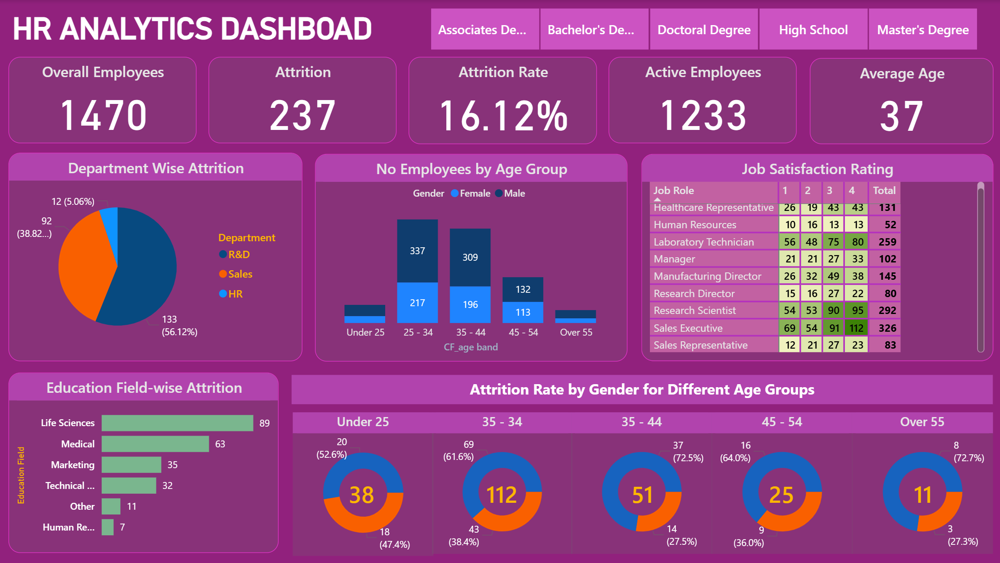

# HR Workforce & Attrition Analytics Dashboard

## 📌 Project Overview
This project analyzes employee attrition, workforce demographics, and job satisfaction to support **data-driven HR and management decisions**.

The dashboard helps organizations understand:
- Who is leaving the company
- Which departments and demographics are most affected
- What factors contribute to employee dissatisfaction and attrition

This project demonstrates my skills in **Power BI, HR analytics, KPI design, and business insight storytelling**.

---

## 🎯 Business Problem
HR departments often struggle with:
- Lack of visibility into workforce attrition
- Difficulty identifying high-risk departments and employee groups
- Reactive decision-making instead of proactive workforce planning

Without analytics, organizations rely on assumptions instead of evidence.

---

## ✅ Solution
An interactive HR Analytics Dashboard that provides:
- Clear workforce KPIs
- Department-wise and demographic attrition analysis
- Job satisfaction insights
- Advanced multi-variable attrition patterns (Age + Gender + Education)

---

## 🖼️ Dashboard Preview

  

---

## 📊 Key Performance Indicators (KPIs)

| KPI | Description |
|----|------------|
| Total Employees | Total employee records |
| Attrition Count | Employees who left the company |
| Attrition Rate | % of employees who left |
| Active Employees | Current workforce size |
| Average Age | Workforce demographic indicator |

---

## 📈 Key Visualizations & Insights

### 1️⃣ Department-wise Attrition
- Identifies departments with high turnover
- Helps management focus retention efforts

### 2️⃣ Employees by Age Group & Gender
- Reveals generational workforce distribution
- Highlights early and mid-career attrition risks

### 3️⃣ Job Satisfaction Analysis
- Compares satisfaction ratings across job roles
- Acts as a leading indicator for attrition

### 4️⃣ Education Field-wise Attrition
- Identifies education-to-role mismatch
- Supports smarter hiring decisions

### 5️⃣ Attrition by Gender & Age Group
- Advanced intersectional analysis
- Reveals hidden workforce challenges

---

## 🛠️ Tools & Technologies
- **Power BI** – Dashboard development & visualization
- **DAX** – KPI and measure calculations
- **Excel / CSV** – Data cleaning & preparation
- **HR Analytics Concepts** – Attrition, retention, workforce planning

---

## 🔍 Key Business Insights
- Attrition is concentrated in specific departments
- Certain demographic groups show higher attrition risk
- Job satisfaction strongly influences employee retention
- Education-job mismatch contributes to turnover

---

## 💡 Business Impact
This dashboard enables organizations to:
- Reduce employee turnover
- Improve retention strategies
- Optimize workforce planning
- Make data-driven HR decisions

---

## 📂 Project Structure
HR-Workforce-Attrition-Analytics/
├── Dashboard/
├── Data/
├── Docs/
├── README.md

## 📬 Contact

**Dara Sum**
Data Analyst | SQL & Power BI
<a href="https://www.linkedin.com/in/darasum-data" target="_blank" 
   style="display: inline-block; padding: 10px 20px; background-color: #0A66C2; 
          color: white; text-decoration: none; border-radius: 5px; font-weight: bold;">
  Connect on LinkedIn
</a>
